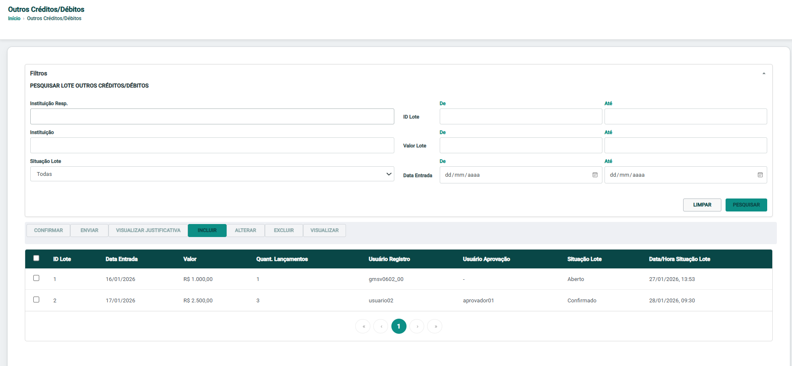
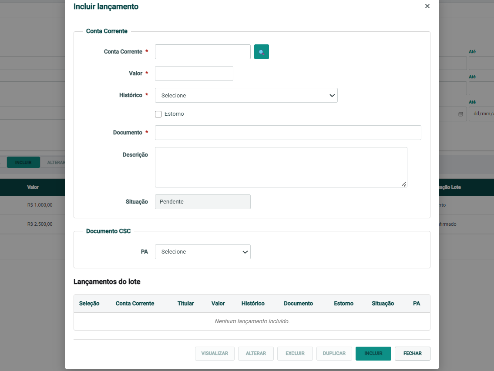

# Outros Créditos/Débitos

Aplicação desenvolvida como solução para um desafio técnico utilizando **Angular 20**. O sistema permite consultar lotes de outros créditos/débitos, aplicar filtros e gerenciar lançamentos através de uma interface moderna e responsiva, utilizando dados mockados em memória para simular operações de backend.

---

# 📷 Prévia da aplicação

## Tela principal



---

## Modal de inclusão



---
---

# 📋 Funcionalidades

## Consulta de Lotes

- Pesquisa de lotes utilizando filtros.
- Limpeza dos filtros.
- Paginação dos resultados.
- Seleção individual e múltipla de lotes.
- Exclusão de lotes.
- Indicador de carregamento durante operações simuladas.

## Lançamentos

- Inclusão de lançamentos.
- Visualização de lançamentos.
- Alteração de lançamentos.
- Exclusão de lançamentos.
- Duplicação de lançamentos.
- Busca de conta corrente através de mock.
- Exibição do titular da conta encontrada.
- Validações reativas em todos os campos obrigatórios.
- Lançamentos armazenados em memória conforme especificação do desafio.

---

# 🚀 Tecnologias

- Angular 20
- TypeScript
- Angular Material
- RxJS
- Angular Signals
- Reactive Forms
- SCSS
- Jasmine
- Karma
- Docker

---

# 📦 Instalação

## Pré-requisitos

- Node.js 22+
- npm
- Docker Desktop (opcional)

---

## Executando sem Docker

Clone o repositório:

```bash
git clone https://github.com/Padualb/projeto-sicoob.git
```

Acesse a pasta do projeto:

```bash
cd projeto-sicoob
```

Instale as dependências:

```bash
npm install
```

Execute a aplicação:

```bash
npm start
```

A aplicação estará disponível em:

```
http://localhost:4200
```

---

## Executando com Docker

### Pré-requisitos

- Docker Desktop instalado.
- Docker Desktop em execução.
Clone o repositório:

```bash
git clone https://github.com/Padualb/projeto-sicoob.git
```

Acesse a pasta do projeto:

```bash
cd projeto-sicoob
```

Execute:

```bash
docker compose up --build
```

A aplicação estará disponível em:

```
http://localhost:4000
```

Para encerrar a aplicação:

```bash
docker compose down
```

---

# 🧪 Testes

Para executar os testes unitários:

```bash
npm test
```

---

# 🏗️ Arquitetura

O projeto foi desenvolvido seguindo boas práticas do ecossistema Angular.

### Principais decisões técnicas

- Utilização de **Standalone Components**.
- Gerenciamento de estado local utilizando **Angular Signals**.
- Formulários desenvolvidos com **Reactive Forms**.
- Componentização visando reutilização e separação de responsabilidades.
- Simulação de chamadas HTTP utilizando **RxJS** e dados mockados.
- Estrutura preparada para futura integração com uma API REST.

---

# 📁 Estrutura do Projeto

```text
src/
└── app
    ├── features
    │   ├── components
    │   ├── models
    │   ├── pages
    │   └── services
    └── shared
        └── validators
```

### Organização

**components**

Componentes reutilizáveis da aplicação, como tabelas, filtros e modais.

**models**

Interfaces e modelos utilizados durante a aplicação.

**pages**

Componentes responsáveis pelas telas da aplicação.

**services**

Camada responsável pelas regras de negócio e pela simulação das chamadas ao backend.

**validators**

Validadores personalizados utilizados pelos formulários reativos.


# 👨‍💻 Autor

**Lucas de Pádua Bergamaschi**

GitHub: https://github.com/Padualb
Linkedin: https://www.linkedin.com/in/lucas-de-padua/
